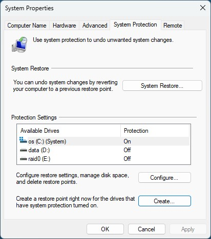

This .reg file re-enables the registry backup that ms removed 2018 ish...

There is also a at scheduler .xml to fix the scheduled task so that it actually runs.

HKEY_LOCAL_MACHINE\SYSTEM\CurrentControlSet\Control\Session Manager\Configuration Manager
Add Dword 32Bit [EnablePeriodicBackup] set to 1

schtasks /run /i /tn "\Microsoft\Windows\Registry\RegIdleBackup"

You´ll find the backups here: C:\Windows\System32\config\RegBack

Also check that system restore points is enabled

